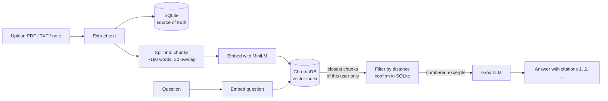

# Study Assistant

<<<<<<< HEAD
Upload your lecture notes, PDFs and text files, then ask questions about them. Every answer
shows the passages it came from (with page numbers for PDFs). The assistant can also write a
quiz from a document and summarize it.

It follows the design of the Smart Knowledge Hub: FastAPI, SQLite, ChromaDB, a local embedding
model, and Groq for the language model.

## Features

- Accounts: bcrypt-hashed passwords, JWT login, per-account rate limits.
- Material: upload `.pdf`, `.txt`, `.md` (up to 10 MB) or write a note. Documents are private to their owner.
- Ask: semantic search finds the most relevant passages, the model answers using only those, and the
  answer cites them as [1], [2]. Click a citation to see the passage.
- Quiz: multiple-choice questions written from a document, graded in the browser with explanations.
- Summary: key points of a document. For very long documents it uses a sample spread across the
  whole text and says so.
- Honest failures: if nothing relevant is found, the model is not called and no answer is invented.
  If the model is unavailable, `/ask` still returns the matching passages.

## Architecture

```text
Browser (frontend/index.html, served at /)
        | HTTP + Bearer token
        v
FastAPI: auth, documents, ask / quiz / summarize
   |             |                |
   v             v                v
SQLite        ChromaDB         Groq LLM
(the truth:   (search index,   (writes answers,
 users,        rebuildable)     quizzes, summaries;
 full text)                     never picks passages)
```

Two rules hold everywhere:

1. **SQLite is the source of truth.** The vector index is a copy that `python reindex.py` can rebuild at any time.
   Documents are saved to SQLite first; if indexing fails, nothing is lost and the document is marked "not searchable yet".
2. **Every query is limited to the logged-in user**, both in the vector search and again in SQL.

## Setup

Python 3.11 or newer.

```bash
python -m venv venv
venv\Scripts\activate            # Windows      (macOS/Linux: source venv/bin/activate)
pip install -r requirements.txt  # large: it downloads PyTorch (several GB)
copy .env.example .env           # macOS/Linux: cp .env.example .env
```

Edit `.env`: set `JWT_SECRET_KEY` (the file explains how) and, for written answers, `GROQ_API_KEY`.
The first search downloads the embedding model (about 90 MB) once.

## Run
=======
**Ask questions about your own notes and PDFs, and get answers that cite their sources.**

A **Retrieval-Augmented Generation (RAG)** app for studying. Upload study material, then ask questions, generate quizzes, or get summaries. Answers come **only** from your documents, with clickable citations that jump to the exact passage (and PDF page). Nothing is invented: when the material does not contain the answer, the app says so.


<!-- Add a screenshot or short GIF here, e.g.  -->

## Features

- **Ask** – semantic search finds the most relevant passages, and the model answers using only those. Citations like `[1]`, `[2]` are clickable and highlight the source passage. PDF answers show page numbers.
- **Quiz** – multiple-choice questions generated from a document and graded in the browser.
- **Summary** – key points of a document. For long documents it tells you how much was used ("based on 12 of 40 sections").
- **Accounts** – register and log in with hashed passwords and JWT tokens. Every document is private to its owner.
- **Graceful failures** – if nothing relevant is found, the model is not called; if the model is unavailable, `/ask` still returns the matching passages.
- **Formats** – PDF, TXT and MD files (up to 10 MB), or pasted notes.


## How it works



Two design rules keep the system simple and safe:

1. **SQLite is the source of truth.** The full text of every document lives there. The vector index can always be rebuilt from it (`reindex.py`), so an indexing failure never loses data.
2. **Every search is scoped to one user.** The `user_id` filter is applied on every vector query, and results are re-checked against SQLite before they are returned.

The language model only **writes**. Which passages it sees is decided by vector search, not by the model.

## Tech stack

| Layer | Technology |
|---|---|
| API | FastAPI |
| Database | SQLite via SQLAlchemy |
| Vector search | ChromaDB (cosine distance) with `all-MiniLM-L6-v2` embeddings |
| LLM | Groq through the OpenAI SDK (default `openai/gpt-oss-20b`) |
| Auth | bcrypt password hashing, JWT (HS256, 24 h) |
| Rate limiting | slowapi (per account, or per IP when logged out) |
| PDF reading | pypdf |
| Frontend | Single-file `index.html`, no build step |

## Project structure

```
study-assistant/
├── app/
│   ├── main.py            App entry point, CORS, routers, serves the web page
│   ├── database.py        SQLite engine and sessions
│   ├── models.py          User and Document tables
│   ├── schemas.py         Request/response validation (Pydantic)
│   ├── security.py        Password hashing and JWT
│   ├── dependencies.py    get_current_user
│   ├── limiter.py         Rate limiter
│   ├── text_utils.py      File reading and chunking
│   ├── rag.py             Vector index: embed, index, search, reindex
│   ├── llm.py             Prompts, model calls, quiz parsing
│   └── routers/
│       ├── auth.py        Register, login, me
│       ├── documents.py   Upload, notes, list, delete
│       └── study.py       Ask, quiz, summarize
├── frontend/
│   └── index.html         Web interface
├── reindex.py             Rebuild the vector index from SQLite
├── requirements.txt
└── .env.example
```

## Getting started

**Requirements:** Python 3.10 or newer and a free [Groq API key](https://console.groq.com/).

```bash
python -m venv venv
# Windows:
venv\Scripts\activate
# macOS / Linux:
source venv/bin/activate

pip install -r requirements.txt
```

Generate a secret for signing tokens and paste it into `.env`:

```bash
python -c "import secrets; print(secrets.token_hex(32))"
```

Run the app from the project root (the folder that contains `app/`):
>>>>>>> 89821cc (Update ReadMe)

```bash
uvicorn app.main:app --reload
```

<<<<<<< HEAD
Open http://127.0.0.1:8000, create an account, add some material, and ask a question.
The API documentation is at http://127.0.0.1:8000/docs.

## Test

```bash
pip install -r requirements-dev.txt
python -m pytest -v
```

The tests use a temporary database and index, a fake embedder and a fake language model, so they
need no internet, no API key, and never touch your data.

## Endpoints

| Method | Path | What it does |
|---|---|---|
| POST | `/auth/register`, `/auth/login` | create an account, get a token |
| GET | `/auth/me` | who am I |
| POST | `/documents/upload` | upload a PDF, TXT or MD file |
| POST | `/documents/note` | save a pasted note |
| GET | `/documents`, `/documents/{id}` | list / read document details |
| DELETE | `/documents/{id}` | delete a document and its search data |
| POST | `/ask` | answer a question from your material, with sources |
| POST | `/quiz` | make a multiple-choice quiz from a document |
| POST | `/summarize` | summarize a document |

## Maintenance

```bash
python reindex.py    # stop the server first
```

Rebuilds the search index from SQLite. Use it after deleting `chroma_db/`, after a "not searchable
yet" warning, or after changing the embedding model.

## Tuning

`MAX_DISTANCE` in `app/routers/study.py` decides how close a passage must be to count as relevant
(0 means identical meaning). If real questions often get "I couldn't find anything relevant", raise it a little;
if unrelated passages show up, lower it. Each source in `/ask` includes its `distance`, and the page shows it when you hover a source title.

## Limits

- Scanned PDFs (pages that are images) are not supported: there is no text to read.
- Text and notes are chunked into about 180 words, because the embedding model reads about 256 tokens.
- Summaries and quizzes of long documents use a sample of sections, not the whole text.
- The database schema is created automatically. There are no migrations yet (Alembic would be the next step).

## Troubleshooting

- `JWT_SECRET_KEY is not set`: create `.env` from `.env.example` in the project root.
- Odd ChromaDB errors when the project is inside OneDrive: sync can lock its files. Set
  `CHROMA_PATH=C:/study_chroma` in `.env` to keep the index outside the synced folder.
- Answers say the AI is unavailable: check `GROQ_API_KEY`, or your internet connection.
=======
Open <http://127.0.0.1:8000>. Interactive API docs are at <http://127.0.0.1:8000/docs>.

> The first upload or search downloads the embedding model (about 90 MB), so it is slow once. `pip install` is also slow the first time because `sentence-transformers` installs PyTorch.

## Configuration

Set these in `.env`:

| Variable | Required | Description |
|---|---|---|
| `JWT_SECRET_KEY` | Yes | Secret used to sign login tokens. The app refuses to start without it. |
| `GROQ_API_KEY` | For AI features | Your Groq key. Without it, search still works but answers, quizzes and summaries are unavailable. |


## API overview

| Method | Endpoint | Description | Limit |
|---|---|---|---|
| POST | `/auth/register` | Create an account | 5/min |
| POST | `/auth/login` | Get a token (form login) | 5/min |
| GET | `/auth/me` | Current user | – |
| POST | `/documents/upload` | Upload a PDF, TXT or MD file | 10/min |
| POST | `/documents/note` | Save a pasted note | 30/min |
| GET | `/documents` | List your documents | – |
| GET | `/documents/{id}` | One document's details | – |
| DELETE | `/documents/{id}` | Delete a document and its vectors | – |
| POST | `/ask` | Ask a question, get an answer with sources | 20/min |
| POST | `/quiz` | Generate a multiple-choice quiz | 5/min |
| POST | `/summarize` | Summarize a document | 5/min |
| GET | `/health` | Health check | – |

All endpoints except register, login and health require `Authorization: Bearer <token>`.

## Security notes

- Passwords are hashed with bcrypt; login uses one error message for "no such user" and "wrong password", and does the same amount of work in both cases.
- Documents are looked up by id **and** owner. Someone else's document returns `404`, the same as a missing one, so ids cannot be probed.
- Upload names are stripped of folders, file size is capped while reading, and extracted text length is capped.
- Uploaded material is treated as untrusted. Every prompt tells the model that excerpts are data, not instructions. This reduces prompt-injection risk but is not a guarantee.
- Rate limits use verified tokens, so a fake token cannot borrow another user's limit.

## Maintenance

If documents are marked `indexed = false`, the vector index was lost, or you changed the embedding model, rebuild it from SQLite:

```bash
python reindex.py
```

Stop the server first, so no upload happens while the index is being rebuilt.


## Known limitations

- **English works best.** `all-MiniLM-L6-v2` is trained mostly on English. For other languages, switch to a multilingual model (for example `paraphrase-multilingual-MiniLM-L12-v2`) and run `reindex.py`.
- **Quiz and summary use a sample** of the document (8 and 12 evenly spaced sections), not the whole text.
- **Scanned PDFs are not supported.** There is no OCR; a PDF made of page images is rejected.
- **Relevance threshold is a starting guess.** `MAX_DISTANCE = 0.8` in `app/routers/study.py` should be tuned on real questions. Hover a source in the UI to see its distance.
- **Reasoning models** may spend `max_tokens` on internal reasoning and return an empty reply. If the AI always seems unavailable, check the logs and raise the token limits in `app/llm.py`.

## Ideas for next steps

- OCR for scanned PDFs
- Multilingual embeddings by default
- Saving quiz results and progress
>>>>>>> 89821cc (Update ReadMe)
